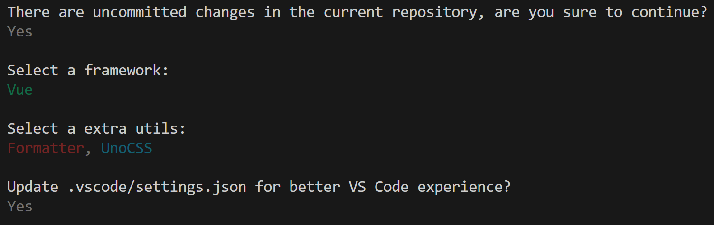
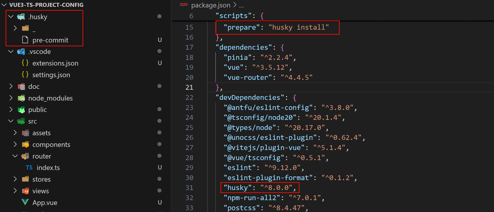
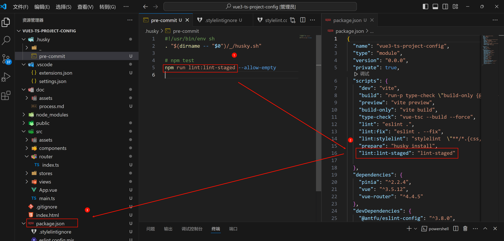
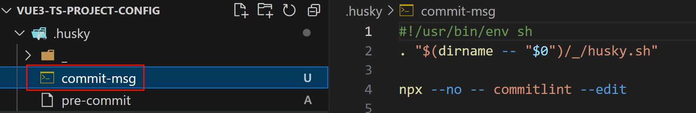

# 开发

```bash
# 安装依赖
pnpm install

# 启动服务
pnpm run dev
```

# 流程

## 前置条件

### node版本

> node 最好>20 因为eslint9的需要

### 包管理器

> 包管理器 采用pnpm

### vscode 插件

> vscode 插件 eslint prettier stylelint unocss vue-official postcss

### git

> 安装官方git 用代码仓库管理

## 创建项目

pnpm create vue

## antfu 组合prettier&eslint

> 配置网站 https://github.com/antfu/eslint-config/tree/feat/support-eslint-9?tab=readme-ov-file

```bash
npx @antfu/eslint-config@latest
```

```bash
pnpm i
```


会添加.vscode/settings.json

### 配置文件

```json
{
  // Disable the default formatter, use eslint instead
  "prettier.enable": false,
  "editor.formatOnSave": false,

  // Auto fix
  "editor.codeActionsOnSave": {
    "source.fixAll.eslint": "explicit",
    "source.organizeImports": "never"
  },

  // Silent the stylistic rules in you IDE, but still auto fix them
  "eslint.rules.customizations": [
    { "rule": "style/*", "severity": "off", "fixable": true },
    { "rule": "format/*", "severity": "off", "fixable": true },
    { "rule": "*-indent", "severity": "off", "fixable": true },
    { "rule": "*-spacing", "severity": "off", "fixable": true },
    { "rule": "*-spaces", "severity": "off", "fixable": true },
    { "rule": "*-order", "severity": "off", "fixable": true },
    { "rule": "*-dangle", "severity": "off", "fixable": true },
    { "rule": "*-newline", "severity": "off", "fixable": true },
    { "rule": "*quotes", "severity": "off", "fixable": true },
    { "rule": "*semi", "severity": "off", "fixable": true }
  ],

  // Enable eslint for all supported languages
  "eslint.validate": [
    "javascript",
    "javascriptreact",
    "typescript",
    "typescriptreact",
    "vue",
    "html",
    "markdown",
    "json",
    "json5",
    "jsonc",
    "yaml",
    "toml",
    "xml",
    "gql",
    "graphql",
    "astro",
    "css",
    "less",
    "scss",
    "pcss",
    "postcss"
  ]
}
```

和eslint.config.mjs,修改为以下

```mjs
import antfu from '@antfu/eslint-config'

export default antfu({
  // @stylistic/eslint-plugin-plus
  stylistic: true,
  // eslint-plugin-format
  formatters: true,
  // unocss 检测&格式化 暂时注释 等配置了unocss再开放为true
  // unocss: true,
  // vue的eslint配置
  vue: true,
  // 保存删除未引入的代码
  // isInEditor: false,
  // 9x版本 忽略文件这种配置方式 废弃掉eslintignore
  ignores: [
    '*.sh',
    'node_modules',
    '*.md',
    '*.woff',
    '*.ttf',
    '.idea',
    '/public',
    'doc',
    '.husky',
    '.local',
    '/bin',
    'Dockerfile',
  ],
})
```

不需要prettier了,eslint会直接帮忙格式化且修改

### 新增脚本

- package.json

```json
{
  "scripts": {
    // ...
    "lint": "eslint .",
    "lint:fix": "eslint . --fix"
  }
}
```

## 安装 styleLint

```bash
pnpm i sass postcss postcss-html  postcss-scss  stylelint stylelint-config-recess-order stylelint-config-standard -D
```

### 配置文件

- stylelint.config.mjs

```js
/** @type {import('stylelint').Config} */
export default {
  // stylelint-config-standard 基础配置
  // stylelint-config-recess-order 样式顺序
  extends: ['stylelint-config-standard', 'stylelint-config-recess-order'],
  // 不同文件类型用不同解析器
  overrides: [
    {
      files: ['**/*.(css|html|vue)'],
      customSyntax: 'postcss-html',
    },
    // 选less可以注释scss
    {
      files: ['*.less', '**/*.less'],
      customSyntax: 'postcss-less',
    },
    // 选sass可以注释上面的less
    {
      files: ['*.scss', '**/*.scss'],
      customSyntax: 'postcss-scss',
      rule: {
        'scss/percent-placeholder-pattern': null,
        'scss/at-mixin-pattern': null,
      },
    },
  ],
  rules: {
    // 'prettier/prettier': true,
    'media-feature-range-notation': null,
    'selector-not-notation': null,
    'import-notation': null,
    'function-no-unknown': null,
    'selector-class-pattern': null,
    'selector-pseudo-class-no-unknown': [
      true,
      {
        ignorePseudoClasses: ['global', 'deep'],
      },
    ],
    'selector-pseudo-element-no-unknown': [
      true,
      {
        ignorePseudoElements: ['v-deep', ':deep'],
      },
    ],
    'at-rule-no-unknown': [
      true,
      {
        ignoreAtRules: [
          'tailwind',
          'apply',
          'variants',
          'responsive',
          'screen',
          'function',
          'if',
          'each',
          'include',
          'mixin',
          'extend',
          'use',
        ],
      },
    ],
    'no-empty-source': null,
    'named-grid-areas-no-invalid': null,
    'no-descending-specificity': null,
    'font-family-no-missing-generic-family-keyword': null,
    'rule-empty-line-before': [
      'always',
      {
        ignore: ['after-comment', 'first-nested'],
      },
    ],
    'unit-no-unknown': [true, { ignoreUnits: ['rpx'] }],
    'order/order': [
      [
        'dollar-variables',
        'custom-properties',
        'at-rules',
        'declarations',
        {
          type: 'at-rule',
          name: 'supports',
        },
        {
          type: 'at-rule',
          name: 'media',
        },
        'rules',
      ],
      { severity: 'error' },
    ],
  },
  ignoreFiles: ['**/*.js', '**/*.jsx', '**/*.tsx', '**/*.ts'],
}
```

settings.json加上

```json
{
  "stylelint.enable": true,
  "stylelint.validate": ["css", "less", "postcss", "scss", "vue", "sass"],
  "editor.codeActionsOnSave": {
    // ...
    "source.fixAll.stylelint": "explicit"
  }
}
```

### 新增脚本

- package.json

  ```json
  {
    "scripts": {
      // ...
      "lint:stylelint": "stylelint  \"**/*.{css,scss,less,vue,html}\" --fix"
    }
  }
  ```

### 忽略文件

- .stylelintignore

```text
/dist/*
/public/*
```

## 代码提交检查

Husky + Lint-staged + Commitlint + Commitizen + cz-git 来配置 Git 提交代码规范。

> 核心内容是配置 Husky 的 pre-commit 和 commit-msg 两个钩子:
>
> pre-commit：Husky + Lint-staged 整合实现 Git 提交前代码规范检测/格式化 (前提：ESlint + Prettier + Stylelint 代码统一规范)；
>
> commit-msg: Husky + Commitlint + Commitizen + cz-git 整合实现生成规范化且高度自定义的 Git commit message。

### husky

Husky 是 Git 钩子工具，可以设置在 git 各个阶段（`pre-commit`、`commit-msg` 等）触发。

官网https://typicode.github.io/husky 推荐安装指令

- 1 前提条件 项目有.git 如果没有需要生成 有git的话不需要这一步

  ```cmd
  git init
  ```

- 2 自动配置husky

  ```cmd
  npx husky-init
  ```



```cmd
pnpm i
```

### Lint-staged 增量检测提交代码

lint-staged 是一个在 git add 到暂存区的文件运行 linters (ESLint/Prettier/StyleLint) 的工具，避免在 git commit 提交时在整个项目执行。

- 1 安装

  ```cmd
  pnpm i lint-staged -D
  ```

- 2 新建lint-staged.config.mjs 配置文件

  ```js
  /**  @type {import('lint-staged').Config} */
  export default {
    '*.{js,jsx,ts,tsx}': ['eslint --fix'],
    '*.json': ['eslint --fix'],
    '*.vue': ['eslint --fix'],
    '*.{scss,less,styl,html}': ['stylelint --fix --allow-empty-input'],
    '*.md': ['prettier --write'],
  }
  ```

- 3 pack.json 添加指令

  ```json
  {
    "lint:lint-staged": "lint-staged"
  }
  ```

- 4 文件`.husky/pre-commit`**修改提交前钩子命令**

  npx命令会自动执行安装过的 lint-staged插件，从而执行lint-staged.config.mjs配置文件

  ```sh
  #!/usr/bin/env sh
  . "$(dirname -- "$0")/_/husky.sh"
  # npm test
  npm run lint:lint-staged --allow-empty
  ```



这样,代码commit前就会进行代码校验,不符合规范则会停止提交

### Commitlint

Commitlint 检查您的提交消息是否符合 Conventional commit format。-- [Commitlint 官网](https://commitlint.js.org/)

- 1 安装

  ```cmd
  pnpm i @commitlint/cli @commitlint/config-conventional -D
  ```

- 2 根目录创建 `commitlint.config.mjs` 配置文件

  ```js
  /** @type {import("@commitlint/types").UserConfig} */
  export default {
    ignores: [commit => commit.includes('init')],
    extends: ['@commitlint/config-conventional'],
    rules: {
      'body-leading-blank': [2, 'always'],
      'footer-leading-blank': [1, 'always'],
      'header-max-length': [2, 'always', 108],
      'subject-empty': [2, 'never'],
      'type-empty': [2, 'never'],
      'subject-case': [0],
      'type-enum': [
        2,
        'always',
        [
          'feat', // 新增功能
          'fix', // 修复缺陷
          'docs', // 文档变更
          'style', // 代码格式（不影响功能，例如空格、分号等格式修正）
          'refactor', // 代码重构（不包括 bug 修复、功能新增）
          'perf', // 性能优化
          'test', // 添加疏漏测试或已有测试改动
          'build', // 构建流程、外部依赖变更（如升级 npm 包、修改 webpack 配置等）
          'ci', // 修改 CI 配置、脚本
          'revert', // 回滚 commit
          'chore', // 对构建过程或辅助工具和库的更改（不影响源文件、测试用例）
        ],
      ],
    },
  }
  ```

- 3 执行下面命令生成 `commint-msg` 钩子用于 git 提交信息校验

  ```cmd
  npx husky add .husky/commit-msg "npx --no -- commitlint --edit $1"
  ```

  

### Commitizen & cz-git

commitizen: 基于Node.js的 git commit 命令行工具，辅助生成标准化规范化的 commit message。
cz-git: 一款工程性更强，轻量级，高度自定义，标准输出格式的 commitizen 适配器。
Commitizen & cz-git 安装

```cmd
pnpm install -D commitizen cz-git
```

cz-git 配置
修改 package.json 指定使用的适配器

```json
{
  "config": {
    "commitizen": {
      "path": "node_modules/cz-git"
    }
  }
}
```

cz-git 与 commitlint 进行联动给予校验信息，所以可以编写于 commitlint 配置文件之中

- commitlint.config.cjs

```
module.exports
= {
  // 继承的规则
  extends: ["@commitlint/config-conventional"],
  // 自定义规则
  rules: {
    // @see https://commitlint.js.org/#/reference-rules

    // 提交类型枚举，git提交type必须是以下类型
    "type-enum": [
      2,
      "always",
      [
        "feat", // 新增功能
        "fix", // 修复缺陷
        "docs", // 文档变更
        "style", // 代码格式（不影响功能，例如空格、分号等格式修正）
        "refactor", // 代码重构（不包括 bug 修复、功能新增）
        "perf", // 性能优化
        "test", // 添加疏漏测试或已有测试改动
        "build", // 构建流程、外部依赖变更（如升级 npm 包、修改 webpack 配置等）
        "ci", // 修改 CI 配置、脚本
        "revert", // 回滚 commit
        "chore", // 对构建过程或辅助工具和库的更改（不影响源文件、测试用例）
        "wip", // 对构建过程或辅助工具和库的更改（不影响源文件、测试用例）
      ],
    ],
    "subject-case": [0], // subject大小写不做校验
  },

  prompt: {
    messages: {
      type: "选择你要提交的类型 :",
      scope: "选择一个提交范围（可选）:",
      customScope: "请输入自定义的提交范围 :",
      subject: "填写简短精炼的变更描述 :\n",
      body: '填写更加详细的变更描述（可选）。使用 "|" 换行 :\n',
      breaking: '列举非兼容性重大的变更（可选）。使用 "|" 换行 :\n',
      footerPrefixesSelect: "选择关联issue前缀（可选）:",
      customFooterPrefix: "输入自定义issue前缀 :",
      footer: "列举关联issue (可选) 例如: #31, #I3244 :\n",
      generatingByAI: "正在通过 AI 生成你的提交简短描述...",
      generatedSelectByAI: "选择一个 AI 生成的简短描述:",
      confirmCommit: "是否提交或修改commit ?",
    },
    types: [
      { value: "feat",     name: "特性:     ✨  新增功能", emoji: ":sparkles:" },
      { value: "fix",      name: "修复:     🐛  修复缺陷", emoji: ":bug:" },
      { value: "docs",     name: "文档:     📝  文档变更(更新README文件，或者注释)", emoji: ":memo:" },
      { value: "style",    name: "格式:     🌈  代码格式（空格、格式化、缺失的分号等）", emoji: ":lipstick:" },
      { value: "refactor", name: "重构:     🔄  代码重构（不修复错误也不添加特性的代码更改）", emoji: ":recycle:" },
      { value: "perf",     name: "性能:     🚀  性能优化", emoji: ":zap:" },
      { value: "test",     name: "测试:     🧪  添加疏漏测试或已有测试改动", emoji: ":white_check_mark:"},
      { value: "build",    name: "构建:     📦️  构建流程、外部依赖变更（如升级 npm 包、修改 vite 配置等）", emoji: ":package:"},
      { value: "ci",       name: "集成:     ⚙️   修改 CI 配置、脚本",  emoji: ":ferris_wheel:"},
      { value: "revert",   name: "回退:     ↩️   回滚 commit",emoji: ":rewind:"},
      { value: "chore",    name: "其他:     🛠️   对构建过程或辅助工具和库的更改（不影响源文件、测试用例）", emoji: ":hammer:"},
      { value: "wip",      name: "开发中:   🚧  开发阶段临时提交", emoji: ":construction:"},
    ],
    useEmoji: true,
    emojiAlign: "center",
    useAI: false,
    aiNumber: 1,
    themeColorCode: "",
    scopes: [],
    allowCustomScopes: true,
    allowEmptyScopes: true,
    customScopesAlign: "bottom",
    customScopesAlias: "custom",
    emptyScopesAlias: "empty",
    upperCaseSubject: false,
    markBreakingChangeMode: false,
    allowBreakingChanges: ["feat", "fix"],
    breaklineNumber: 100,
    breaklineChar: "|",
    skipQuestions: [],
    issuePrefixes: [
      { value: "closed", name: "closed:   ISSUES has been processed" },
    ],
    customIssuePrefixAlign: "top",
    emptyIssuePrefixAlias: "skip",
    customIssuePrefixAlias: "custom",
    allowCustomIssuePrefix: true,
    allowEmptyIssuePrefix: true,
    confirmColorize: true,
    maxHeaderLength: Infinity,
    maxSubjectLength: Infinity,
    minSubjectLength: 0,
    scopeOverrides: undefined,
    defaultBody: "",
    defaultIssues: "",
    defaultScope: "",
    defaultSubject: "",
  },
};

```

添加提交指令

package.json 添加 commit 指令

```
 "scripts": {
     "commit": "git-cz"
 }
```

npm run commit

## 引入ELementPlus

```cmd
pnpm install element-plus
```

自动引入

```cmd
pnpm install -D unplugin-vue-components unplugin-auto-import
```

```ts
import AutoImport from 'unplugin-auto-import/vite'
import { ElementPlusResolver } from 'unplugin-vue-components/resolvers'
import Components from 'unplugin-vue-components/vite'
// vite.config.ts
import { defineConfig } from 'vite'

export default defineConfig({
  // ...
  plugins: [
    // ...
    AutoImport({
      resolvers: [ElementPlusResolver()],
    }),
    Components({
      resolvers: [ElementPlusResolver()],
    }),
  ],
})
```

识别出element组件

```json
// tsconfig.json
{
  "compilerOptions": {
    // ...
    "types": ["element-plus/global"]
  }
}
```

## 安装UnoCss

官网https://unocss.dev/guide/

- 安装
  > pnpm i unocss @iconify-json/ep @unocss/preset-rem-to-px -D
  > unocss 核心库
  > @iconify-json/ep是ElementPlus的图标库 https://icones.js.org/ 网站里面找
  > @unocss/preset-rem-to-px把unocss自带的rem转为px
  > icon官网https://unocss.dev/presets/icons
  > 博客https://blog.csdn.net/qg_42618566/article/details/135680388

uno.config.ts

```ts
import presetRemToPx from '@unocss/preset-rem-to-px'
import {
  defineConfig,
  presetAttributify,
  presetIcons,
  presetUno,
  transformerDirectives,
  transformerVariantGroup,
} from 'unocss'

export default defineConfig({
  shortcuts: {
    'flex-center': 'flex justify-center items-center',
    'flex-x-center': 'flex justify-center',
    'flex-y-center': 'flex items-center',
    'wh-full': 'w-full h-full',
    'flex-x-start': 'flex items-center justify-start',
    'flex-x-between': 'flex items-center justify-between',
    'flex-x-end': 'flex items-center justify-end',
    'absolute-lt': 'absolute left-0 top-0',
    'absolute-rt': 'absolute right-0 top-0 ',
    'fixed-lt': 'fixed left-0 top-0',
  },
  presets: [
    presetUno(),
    presetAttributify(),
    // 自动引入图标
    presetIcons({
      scale: 1.2,
      warn: true,
    }),
    presetRemToPx({
      baseFontSize: 4,
    }),
  ],
  transformers: [transformerDirectives(), transformerVariantGroup()],
})
```

eslint.config.mjs 开启unocss 检测&格式化

```js
unocss: true
```

ElementPlus 图片 https://icones.js.org/collection/ep

或者直接使用svg

## vite插件

### gzip压缩

pnpm i vite-plugin-compression -D

vite.config.ts配置

```ts
// 压缩gzip
import vitecompression from 'vite-plugin-compression'

export default defineconfig({
  // ...
  plugins: [
    vitecompression({
      verbose: true, // 默认即可
      disable: false, // 开启压缩（不禁用)，默认即可
      deleteOriginFile: false, // 删除源文件
      threshold: 10240, // 压缩前最小文件大小
      algorithm: 'gzip', // 压缩算法
      ext: '.gz'// 文件类型
    })
  ]
})
```

### 自动重启

pnpm i vite-plugin-restart -D

vite.config.ts配置

```ts
// 压缩gzip
import vitecompression from 'vite-plugin-compression'

export default defineconfig({
  // ...
  plugins: [
    ViteRestart({
      restart: ['*.config.[jt]s', '**/config/*.[jt]s', '*.[cm]js'],
    }),
  ]
})
```

### 跨域配置

"dev": "vite --host"
既能解决控制台network显示,局域网连接,又能不影响vueDevTools插件使用

### 打包分析插件

pnpm i rollup-plugin-visualizer -D

### rem转换

pnpm add vite-plugin-px2rem -D

```
px2rem({
  width: 750,
  rootFontSize: 16,
}),
```

压缩js代码
pnpm i terser -D

### 图片压缩

npm i vite-plugin-image-optimizer -D

## mock

pnpm i mockjs vite-plugin-mock@2.9.6 -D
